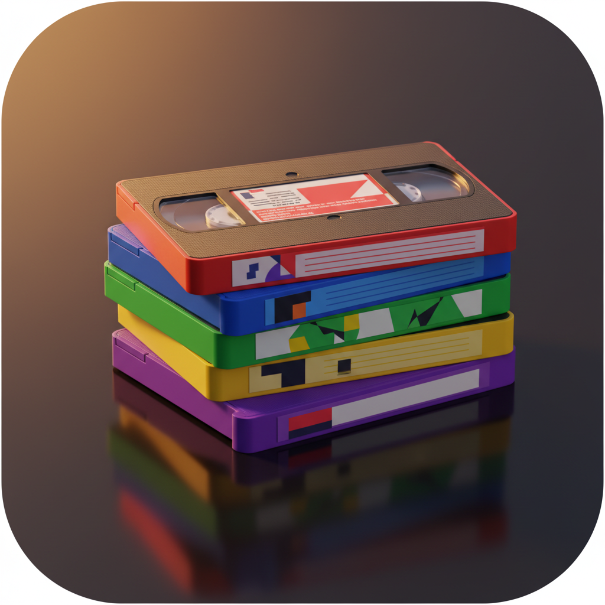

<p align="center">
  
</p>

# Be Kind Rewind 📼

A macOS app for organizing your YouTube video library by topic. Like sorting your VHS collection, but with AI.

## What it does

Takes a collection of YouTube videos (from any playlist) and organizes them into topic categories using Claude AI:

1. **Scan** — Capture video titles and channels from a playlist
2. **Classify** — Claude analyzes channels and titles to suggest ~15-25 topic categories
3. **Browse** — Visual grid of video thumbnails grouped by topic with sticky section headers
4. **Refine** — Split broad topics, merge similar ones, rename, or move individual videos
5. **Sync** — (Coming soon) Push changes back to YouTube as playlists

## Features

### Classification
- Two-step approach: discover topics from channels, then classify videos against the fixed list
- Haiku for fast initial classification (~$0.15 for 5K videos)
- Sonnet for topic splitting and refinement
- Sub-topic discovery within categories

### Browser App
- iPhoto-style adaptive thumbnail grid
- Sidebar with topic icons and colors
- Keyboard navigation: h/j/k/l, arrows, Page Up/Down, Home/End
- Section progress bars in sticky headers
- Hover effects with hand cursor
- Double-click to open on YouTube
- Adjustable thumbnail size
- Persistent thumbnail cache (~75MB for 5K videos, instant after first load)
- Settings: thumbnail size, channel name/icon visibility

### CLI
```bash
# Suggest topics from an inventory
video-tagger suggest --inventory inventory.json --topics 15

# Preview sub-topics within a category
video-tagger subtopics 2 --count 5

# Split a broad topic
video-tagger split 1 --into 4

# Merge similar topics
video-tagger merge 3 7

# Reclassify unassigned videos
video-tagger reclassify

# Resync playlist provenance for all known playlists
video-tagger verify-all-playlists --db /tmp/full-tagger-v2.db

# Push queued playlist-save actions to YouTube
video-tagger sync-pending --db /tmp/full-tagger-v2.db

# Open the persistent browser profile and sign in to YouTube for browser-backed sync
video-tagger browser-sync-login

# Import seen-history from a Google Takeout/My Activity export
video-tagger import-seen-history --db /tmp/full-tagger-v2.db --file /path/to/watch-history.html
```

Playlist provenance notes:
- playlist identities can be imported from a `youtube-cli` `playlists.json` artifact
- playlist memberships are verified via the YouTube API using stored OAuth tokens
- rerun `video-tagger verify-all-playlists --db /tmp/full-tagger-v2.db` whenever you want to refresh playlist membership data for the current library
- rerun `video-tagger sync-pending --db /tmp/full-tagger-v2.db` to manually flush queued playlist-save actions; browser-only actions like `Not Interested` remain deferred until a browser executor is attached
- use `video-tagger browser-sync-login` once to sign the dedicated browser-sync Chrome profile into YouTube; browser sync failure artifacts are written under `output/playwright/browser-sync/`
- import historical watch history with `video-tagger import-seen-history --db /tmp/full-tagger-v2.db --file /path/to/export.html`; the importer supports best-effort `.json`, `.html`, `.htm`, and `.txt` Takeout/My Activity exports and exact `video_id` matches are excluded from watch-candidate results

Runtime notes:
- `./build-app.sh` is the supported packaging path; it signs the app and bootstraps the managed discovery Python environment
- discovery fallback uses a repo-managed venv under `.runtime/discovery-venv` with `scrapetube` installed from `scripts/requirements-discovery.txt`
- browser-backed sync uses the dedicated Chrome profile at `~/.config/be-kind-rewind/playwright-profile`

## Requirements

- macOS 14+
- Anthropic API key (stored in `~/.config/anthropic/api-key` or macOS Keychain)
- An inventory.json from [yt-cli](https://github.com/malpern/yt-cli)

## Build

```bash
# Build everything
swift build

# Build and package the app
./build-app.sh
open "Video Organizer.app"

# Run tests
swift test
```

Commits also run local Swift checks automatically through the repo's pre-commit hook. If staged changes include `*.swift`, `Package.swift`, or `build-app.sh`, the hook runs `swift test` before the commit completes. Docs-only commits skip the check. To bypass it intentionally, use `SKIP_LOCAL_CHECKS=1 git commit ...`.

## Architecture

```
Sources/
├── TaggingKit/          # Library (shared between CLI and app)
│   ├── ClaudeClient     # Lightweight Anthropic API client
│   ├── TopicSuggester   # Two-step classify: discover → assign
│   ├── TopicStore        # SQLite: topics, videos, commit table
│   ├── InventoryLoader  # Reads yt-cli inventory.json snapshots
│   └── VideoItem        # Data model
├── VideoTagger/         # CLI executable
│   └── VideoTaggerCommand  # suggest, split, merge, rename, etc.
└── VideoOrganizer/      # SwiftUI macOS app
    ├── OrganizerStore   # @Observable view model bridging SQLite
    ├── AllVideosGridView # Sectioned grid with keyboard nav
    ├── TopicSidebar     # Topic list with icons
    ├── ThumbnailCache   # Persistent disk cache
    └── DisplaySettings  # User preferences
```

- **Local-first**: All changes happen instantly in SQLite. No YouTube mutations until explicit sync.
- **Commit table**: Queued mutations are collapsed to net effects before sync (A→B→C becomes A→C).
- **29 tests** across 7 suites covering TopicStore CRUD, merge, sync collapse, and data models.

## Related

- [yt-cli](https://github.com/malpern/yt-cli) — YouTube browser automation (inventory scanning)
- [yt-mover](https://github.com/malpern/yt-mover) — Watch Later migration app

## License

MIT
