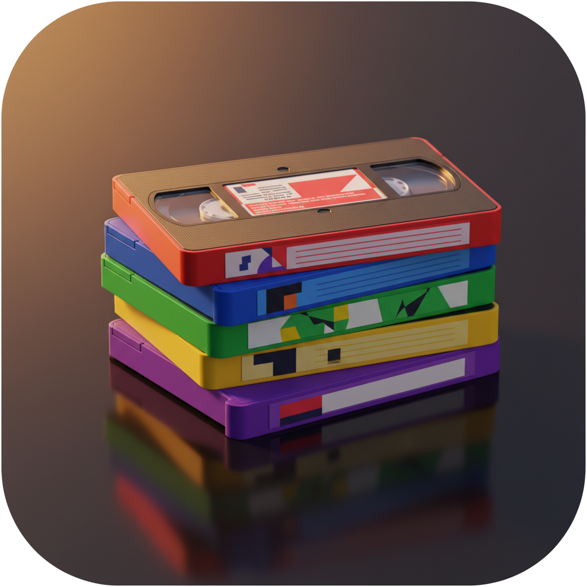
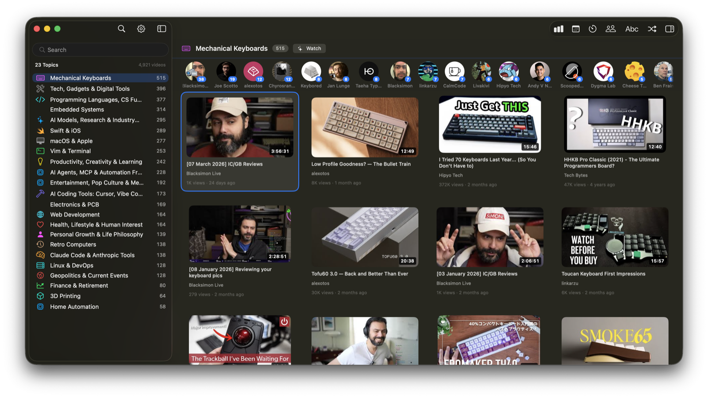

<p align="center">
  
</p>

# Be Kind Rewind 📼

A macOS app for organizing your YouTube video library by topic. Like sorting your VHS collection, but with AI.



## Download

Download the latest packaged app from [GitHub Releases](https://github.com/malpern/be-kind-rewind/releases/latest).

## End-user setup

### What you need

- macOS 14+
- An Anthropic API key for topic generation and classification
- Optional: a YouTube API key for richer discovery refreshes
- Optional: Google OAuth setup if you want playlist saves, private playlist reads, or Watch Later sync

### 1. Install the app

1. Download the latest `Be.Kind.Rewind.zip` from [Releases](https://github.com/malpern/be-kind-rewind/releases/latest).
2. Unzip it.
3. Move `Be Kind, Rewind.app` into `Applications`.
4. Open the app.

On first launch, new installs with missing credentials will show a short setup screen that points you to the right Settings panels. If you already have keys configured, the app skips that screen.

### 2. Add your Anthropic API key

In the app:

1. Open `Settings`
2. Go to `API Keys`
3. Paste your Anthropic API key
4. Click `Save Anthropic Key`

The key is stored securely in your macOS Keychain.

### 3. Optional: add a YouTube API key

This improves discovery refreshes and playlist verification.

In the app:

1. Open `Settings`
2. Go to `API Keys`
3. Paste your YouTube Data API key
4. Click `Save YouTube API Key`

The key is stored securely in your macOS Keychain.

### 4. Optional: connect YouTube for saves and private playlists

If you want:

- `Save to Watch Later`
- `Save to Playlist`
- private playlist provenance
- browser fallback actions like `Not Interested`

then do this:

1. Create a Google OAuth desktop client.
2. Download the client JSON.
3. In the app, open `Settings`.
4. In the `YouTube` section, click `Import OAuth Client JSON…`.
5. Select the downloaded JSON file.
6. Click `Reconnect` or `Upgrade Access`.
7. In the `Sync` section, use `Open Browser Sign-In` once so the browser fallback profile is signed into YouTube too.

### 5. Optional: import watch history

If you export Google Takeout / My Activity watch history, you can import it in:

- `Settings > History > Import Watch History…`

That suppresses already-watched videos from the `Watch` candidate list.

### Manual fallback locations

If you already have keys configured elsewhere, the app also reads:

- Anthropic:
  - `~/.config/anthropic/api-key`
  - `ANTHROPIC_API_KEY`
- YouTube Data API:
  - `~/.config/youtube/api-key`
  - `YOUTUBE_API_KEY`
  - `GOOGLE_API_KEY`
- Google OAuth client config:
  - `~/.config/youtube/oauth-client.json`

## What it does

Takes a collection of YouTube videos (from one or more playlists) and organizes them into topic categories using Claude AI:

1. **Scan** — Capture video titles and channels from a playlist
2. **Classify** — Claude analyzes channels and titles to suggest ~15-25 topic categories
3. **Browse** — Visual grid of video thumbnails grouped by topic with sticky section headers
4. **Discover** — Generate per-topic watch candidates from creator archives, playlist overlap, and fallback discovery
5. **Refine** — Split broad topics, merge similar ones, rename, or move individual videos
6. **Sync** — Save to playlists, queue browser-backed actions, and keep local state optimistic and fast

## Features

### Classification
- Two-step approach: discover topics from channels, then classify videos against the fixed list
- Haiku for fast initial classification (~$0.15 for 5K videos)
- Sonnet for topic splitting and refinement
- Sub-topic discovery within categories

### Browser App
- iPhoto-style adaptive thumbnail grid
- Sidebar with topic icons and colors
- Keyboard navigation: h/j/k/l, arrows, Page Up/Down, Home/End
- Hover-driven inspector updates
- Native context menus and menu bar actions
- Keyboard triage shortcuts for Watch / playlist management
- Per-topic `Watch` mode with floating discovery progress HUD
- Real Settings window for API access, history import, and sync status
- Double-click to open on YouTube
- Adjustable thumbnail size
- Persistent thumbnail cache (~75MB for 5K videos, instant after first load)
- Persistent SQLite-backed state for playlists, candidates, seen-history, and sync queue

### CLI
```bash
# Suggest topics from an inventory
video-tagger suggest --inventory inventory.json --topics 15

# Preview sub-topics within a category
video-tagger subtopics 2 --count 5

# Split a broad topic
video-tagger split 1 --into 4

# Merge similar topics
video-tagger merge 3 7

# Reclassify unassigned videos
video-tagger reclassify

# Resync playlist provenance for all known playlists
video-tagger verify-all-playlists --db /tmp/full-tagger-v2.db

# Push queued playlist-save actions to YouTube
video-tagger sync-pending --db /tmp/full-tagger-v2.db

# Open the persistent browser profile and sign in to YouTube for browser-backed sync
video-tagger browser-sync-login

# Import seen-history from a Google Takeout/My Activity export
video-tagger import-seen-history --db /tmp/full-tagger-v2.db --file /path/to/watch-history.html
```

Playlist provenance notes:
- playlist identities can be imported from a `youtube-cli` `playlists.json` artifact
- playlist memberships are verified via the YouTube API using stored OAuth tokens
- rerun `video-tagger verify-all-playlists --db /tmp/full-tagger-v2.db` whenever you want to refresh playlist membership data for the current library
- rerun `video-tagger sync-pending --db /tmp/full-tagger-v2.db` to manually flush queued playlist-save actions; browser-only actions like `Not Interested` remain deferred until a browser executor is attached
- use `video-tagger browser-sync-login` once to sign the dedicated browser-sync Chrome profile into YouTube; browser sync failure artifacts are written under `output/playwright/browser-sync/`
- import historical watch history with `video-tagger import-seen-history --db /tmp/full-tagger-v2.db --file /path/to/export.html`; the importer supports best-effort `.json`, `.html`, `.htm`, and `.txt` Takeout/My Activity exports and exact `video_id` matches are excluded from watch-candidate results

Runtime notes:
- `./build-app.sh` is the supported packaging path; it signs the app and bootstraps the managed discovery Python environment
- discovery fallback uses a repo-managed venv under `.runtime/discovery-venv` with `scrapetube` installed from `scripts/requirements-discovery.txt`
- browser-backed sync uses the dedicated Chrome profile at `~/.config/be-kind-rewind/playwright-profile`

## Developer setup

### Requirements

- macOS 14+
- Swift toolchain with SwiftPM
- Anthropic API key (stored in `~/.config/anthropic/api-key` or macOS Keychain)
- Optional: YouTube API key in `~/.config/youtube/api-key`
- Optional: Google OAuth desktop client config at `~/.config/youtube/oauth-client.json`
- An inventory.json from [yt-cli](https://github.com/malpern/yt-cli)

### Build

```bash
# Build everything
swift build

# Build and package the app
./build-app.sh
open "Be Kind, Rewind.app"

# Run tests
swift test
```

Commits also run local Swift checks automatically through the repo's pre-commit hook. If staged changes include `*.swift`, `Package.swift`, or `build-app.sh`, the hook runs `swift test` before the commit completes. Docs-only commits skip the check. To bypass it intentionally, use `SKIP_LOCAL_CHECKS=1 git commit ...`.

## Architecture

```text
Sources/
├── TaggingKit/            # Shared storage, YouTube clients, sync, discovery fallback
├── VideoTagger/           # CLI executable and workflow commands
└── VideoOrganizer/        # SwiftUI/AppKit macOS app
    ├── OrganizerStore     # Main observable app state
    ├── OrganizerStore+*   # Discovery, sync, creator analytics, seen-history
    ├── GridSection*       # Grid shaping and grouping logic
    ├── CollectionGridView # AppKit-backed grid and context menu handling
    ├── TopicSidebar       # Topic/filter navigation
    └── AppSettingsView    # API/history/sync settings
```

- **Local-first**: All changes happen instantly in SQLite. No YouTube mutations until explicit sync.
- **Commit table**: Queued mutations are collapsed to net effects before sync (A→B→C becomes A→C).
- **Tested across 3 test targets**: `TaggingKitTests`, `VideoTaggerTests`, and `VideoOrganizerTests`.
- **Current suite size**: 113 tests covering storage, CLI workflows, organizer state, grid sectioning, OAuth, sync routing, and discovery/archive behavior.

## Related

- [yt-cli](https://github.com/malpern/yt-cli) — YouTube browser automation (inventory scanning)
- [yt-mover](https://github.com/malpern/yt-mover) — Watch Later migration app

## License

MIT
